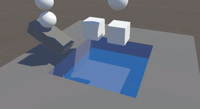

# Floatability System

A lightweight buoyancy and fluid interaction system for Unity, designed to provide physically believable behaviour without the cost or complexity of a full fluid simulation.

The project is currently under active development and focuses on gameplay-oriented rigidbody buoyancy.

## Demo

  

## How it works

Fluid regions are represented by `FluidVolume` components using trigger colliders.

When a `BuoyantBody` enters a fluid volume, it is registered in a central `BuoyancySystem`, which performs the simulation during Unity's physics updates.

For each submerged object, the system:

1. Transforms the mesh vertices into world space.
2. Calculates their depth relative to the fluid surface.
3. Clips each mesh triangle against the fluid surface.
4. Computes the area, centroid and normal of the submerged triangles.
5. Calculates hydrostatic pressure based on fluid density and depth.
6. Applies the resulting forces to the rigidbody using `AddForceAtPosition`.
7. Applies hydrodynamic drag based on the local velocity of each submerged surface.

Because forces are applied across the object's submerged surface rather than as a single upward force, rotation and torque emerge naturally from the simulation.

## Current architecture

- `BuoyantBody`
  - Requires a `Rigidbody` and `MeshFilter`.
  - Provides the mesh used by the simulation.

- `FluidVolume`
  - Defines a fluid region using a trigger collider.
  - Stores fluid properties such as density.
  - Registers and unregisters buoyant bodies.

- `BuoyancySystem`
  - Automatically created at runtime.
  - Keeps track of active body/fluid interactions.
  - Performs buoyancy and drag calculations during `FixedUpdate`.

- `GeometryUtils`
  - Contains reusable geometry operations such as triangle clipping and triangle data calculations.

## Debugging

The system includes runtime Gizmo visualization for:

- Submerged triangles
- Triangle centroids
- Surface normals
- Applied forces

These tools are currently used extensively to validate the simulation.

## Current limitations

The current implementation assumes:

- Static fluid surfaces.
- Box-shaped fluid volumes.
- Closed meshes with consistent triangle winding.
- A `MeshFilter`-based buoyancy mesh.
- No wave simulation or dynamic fluid deformation.

These limitations may be relaxed as the project evolves.

## Unity project

Clone the repository and open its root directory as a Unity project.

Unity will regenerate local folders such as `Library`, `Temp` and IDE project files automatically.
